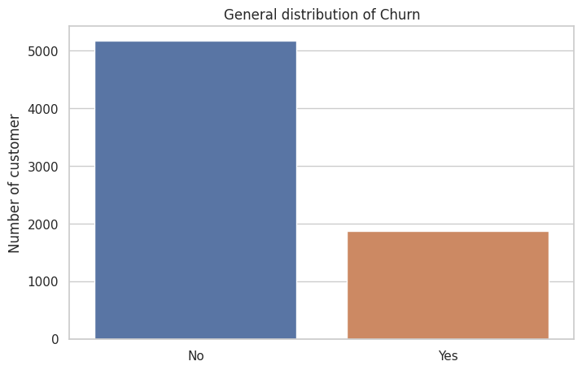
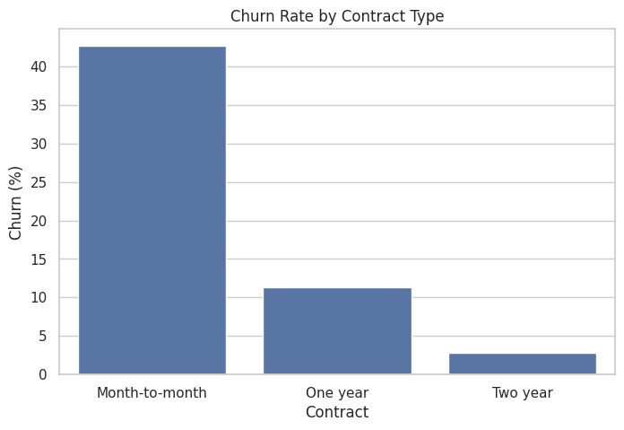
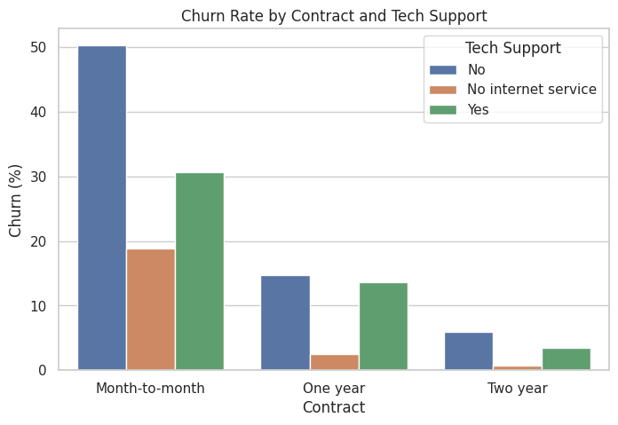

# Telco Customer Churn Analysis

## 📌 Project Overview
This project analyzes customer churn in a telecom company

The goal is to:
  - Measure overall churn
  - Identify which customers are most likely to leave
  - Define the highest-risk segment
  - Provide business recommendations to reduce churn

## 🎯 Business Questions
1. What percentage of customers are churning?
2. Which type of customers are driving churn?
3. Where should the company focus retention efforts?

## 🗂 Dataset
  - Source: Abdallah Wagih Ibrahim
  - Name: Telco Customer Churn

## 🛠 Methodology
### Step 1 — Measure Overall Churn
Calculate the total churn rate and show the distribution

### Step 2 — Analyze Churn by Key Dimensions
Analyze churn by:
  - Contract type
  - Tech Support
  - Tenure

### Step 3 — Interaction Effects
Analyze churn by combining:
  - Contract + Tech Support
  - Tenure over time

### Step 4 — High-Risk Segment Analysis
Define and measure the highest-risk group

Customers with:
  - Month-to-month contract
  - No Tech Support
  - Tenure less than 5 months

Then calculate:
  - The churn rate of this group
  - The percentage of total churn
  - The size of this group compared to all customers

## 📈 Key Findings
  - Total churn rate: 26%
  - Most customers leave in the first 5 months (47–60%)
  - New customers (tenure < 5 months) are at highest risk
  - Month-to-month contracts and no tech support increase churn

## 📊 Key Visualizations
### Overall Churn
  

### Churn by Contract
  

### Contract and Tech Support
  

## 💼 Business Interpretation
Churn is concentrated among new customers without:
  - Long-term contracts
  - Technical support
  - This indicates an early-stage retention problem.

## 🚀 Recommendations
  - Help new customers in the first 90 days
  - Promote annual contracts
  - Offer tech support
  - Monitor risky customers early

## ⚠ Limitations
  - Only descriptive analysis
  - No predictive model
  - No cause analysis

## 🧰 Technologies Used
  - Python
  - Pandas
  - SQLite
  - Seaborn
  - Matplotlib

Matplotlib

Seaborn
