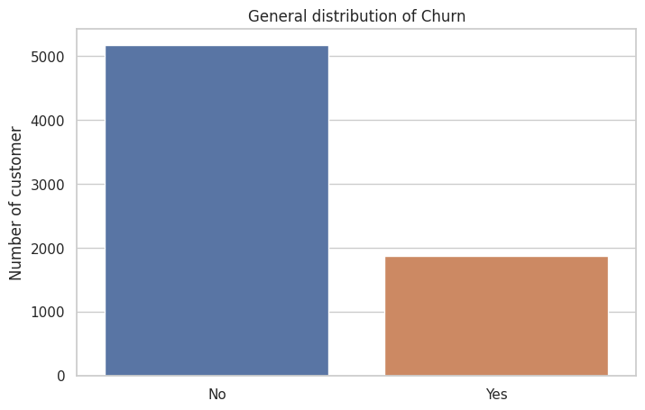
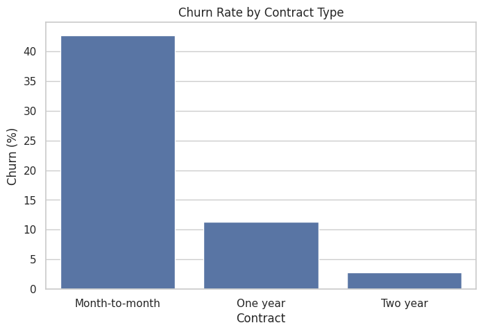
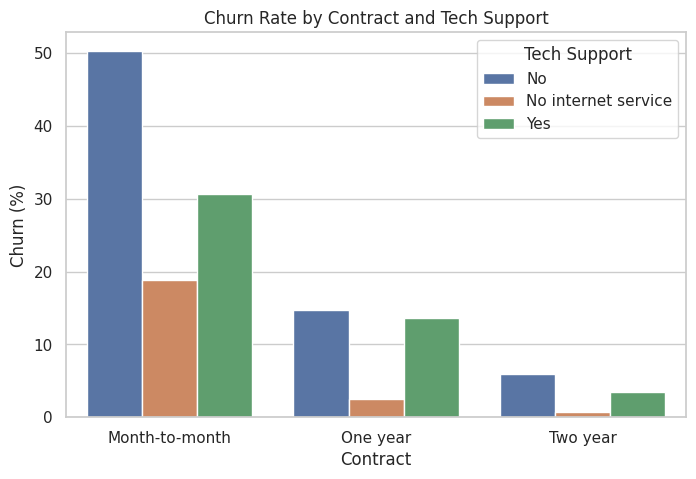

# Telco Customer Churn Analysis

## 📌 Project Overview
This project studies customer churn in a telecom company.

It uses:
- SQL
- Data analysis (EDA)
- Machine Learning
- Dashboard (Looker Studio)

The goal is:
- Understand churn
- Find risky customers
- Estimate money at risk

---

## 🎯 Business Questions
1. What is the churn rate?
2. Which services or contracts are related to churn?
3. Does no tech support increase churn in short contracts?

---

## 🗂 Dataset
- Source: Abdallah Wagih Ibrahim
- Name: Telco Customer Churn

---

## 🛠 Methodology

### 1. Data Cleaning
- Converted "Total Charges" to number
- Removed extra columns
- Fixed missing values
- Saved data in SQLite

---

### 2. SQL Analysis
Used SQL to:
- Calculate churn
- Group customers
- Analyze data

---

### 3. Data Analysis (EDA)
Used Seaborn and Matplotlib.

Analysis:
- Total churn
- Churn by contract
- Churn by tech support
- Churn by time (tenure)
- Churn by payment method
- Contract + tech support

---

### 4. High-Risk Customers

High-risk group:
- Month-to-month contract
- No tech support
- Tenure < 5 months

Measured:
- Churn rate
- Impact on total churn
- Group size

---

## 🤖 Predictive Model

Used Random Forest model.

### Features:
- Contract
- Tech Support
- Tenure
- Phone Service
- Internet Service
- Monthly Charges

### Output:
- Churn probability
- Risk level:
  - High Risk (> 0.7)
  - Medium Risk (> 0.6)
  - Low Risk

---

## 📈 Key Results

- Churn rate: 26.5%
- Many customers leave early
- High churn in:
  - Month-to-month contracts
  - No tech support
- New customers are high risk

---

## 💰 Business Impact

- High-risk customers: 861
- Revenue at risk: 69,863

This helps the company focus on retention.

---

## 📊 Dashboard (Looker Studio)

Dashboard shows:
- Churn KPIs
- Churn by groups
- Risk levels
- Customer predictions

🔗 **View Dashboard:** [Open Dashboard](https://lookerstudio.google.com/s/srYcqN5Pkdw)

---

## 📉 Visualizations

### Overall Churn

### Churn by Contract

### Contract + Tech Support

---

## 💼 Business Insights

- New customers leave more
- No tech support = more churn
- Short contracts = more churn

---

## 🚀 Recommendations

- Help new customers (first 90 days)
- Offer long contracts
- Give tech support
- Monitor risky customers

---

## 🧰 Technologies

- Python
- Pandas
- SQLite
- Scikit-learn
- Seaborn
- Matplotlib
- Looker Studio
